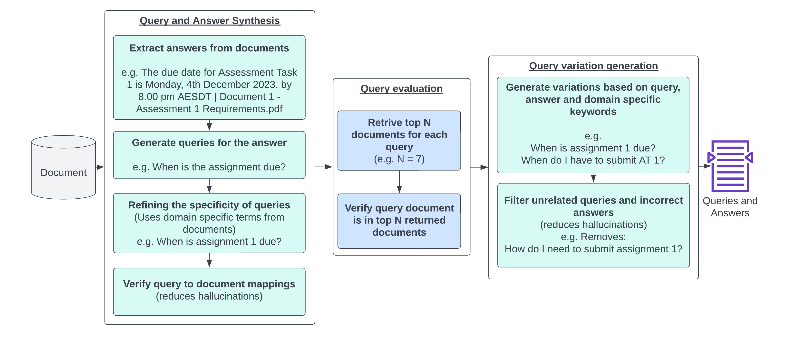

# VaryGen

A test input generation approach using LLM. This 3-step approach, combines the strengths of LLMs, domain knowledge, and rigorous evaluation to generate diverse, contextually relevant, and high-quality test input data for semantic applications.



Paper link: [arXiv](https://arxiv.org/abs/2401.08138)

## Basic usage

### Setup Environment

Install Python dependencies:

```bash
poetry install
```

Create a ``.env.local`` file and enter the following:

```bash
OPENAI_API_KEY=""
OPENAI_ORGANIZATION=""
```

### Start the database

```bash
docker compose up -d
```

### Run the indexing pipeline

```bash
poetry run python3 varygen.py content_dir=../content-download/content pipeline=INDEXING
```

For a full list of what can be configured, see the [config.py](./varygen/config.py) file.

> Note: To run the indexing pipeline on a new set of content, you will need to clear the database first. You can do this by running `docker compose down -v` and then `docker compose up -d` again.

## Run questions generation pipeline

This pipeline is used to generation question-answer datasets from either 1) documents or 2) existing question-answer sets.

To run the full end to end pipeline, you need to set up the required CSV placed at `input/document_list.csv`

```csv
filename,keywords_to_insert
1604.00117.pdf,Domain Adaptation of Recurrent Neural Networks for Natural Language Understanding
```

The `filename` column needs to contain the exact filename based on what is available on the `location` path of the Document metadata in your Vector Store.

Then run the following command:

```bash
poetry run python3 varygen.py pipeline=QA_GENERATION
```

The results will be saved to a file called `new_questions.csv` in the `output` directory (in a timestamped subdirectory).

If you have failed run, you can actually resume from the last completed stages/questions by using the command below:

```bash
poetry run python3 varygen.py pipeline=QA_GENERATION output_dir_from_previous_run=path/to/the/previous/failed/run
```

For example:

```bash
poetry run python3 varygen.py pipeline=QA_GENERATION output_dir_from_previous_run=./output/2023-11-30-15-51-19
```

### Question generation

This step will only run the question generation part from documents (chunks). It will need to have the same CSV as the full pipeline placed at `input/document_list.csv`.

**Firstly**, you will need to ensure that you have documents indexed in the vector store. Follow instruction under the [Indexing](#run-the-indexing-pipeline) section to populate it if required.

**Note**: You only need to index if have nothing in your vector store.

Once documents are populated, then run the following command:

```bash
poetry run python3 varygen.py pipeline=QA_GENERATION assembler=questions_generation
```

The results will be saved to a file called `original_questions.csv` in the `output` directory (in a timestamped subdirectory).

### Variation generation

This step will only run the variations generation part, assuming that you already have question-answer sets ready as an input.

So first make sure you have a CSV file placed at `input/original_questions.csv` with the following format:

```csv
question,answer,chunk_numbers,chunks,filename
"What is the primary objective of the document ""Automatic Differentiation in ROOT"" concerning the scaling of slot filling models in the context of natural language understanding?","The primary objective of the document is to use multi-task learning to efficiently scale slot filling models for natural language understanding to handle multiple target tasks or domains, with a focus on reducing the amount of training data needed to learn a model for a new task.",[0],"['Filename: 1604.00117.pdf\nLocation: > varygen > input\n""""""Domain Adaptation of Recurrent Neural Networks for Natural Language\nUnderstanding\nAaron Jaech1, Larry Heck2, Mari Ostendorf1\n1University of Washington\n2Google Research\najaech@uw.edu, larryheck@google.com, ostendor@uw.edu\nAbstract\nThe goal of this paper is to use multi-task learning to efficiently\nscale slot filling models for natural language understanding to\nhandle multiple target tasks or domains. The key to scalability\nis reducing the amount of training data needed to learn a model\nfor a new task. The proposed multi-task model delivers better\nperformance with less data by leveraging patterns that it learns\nfrom the other tasks. The approach supports an open vocabu-\nlary, which allows the models to generalize to unseen words,\nwhich is particularly important when very little training data is\nused. A newly collected crowd-sourced data set, covering four\ndifferent domains, is used to demonstrate the effectiveness of\nthe domain adaptation and open vocabulary techniques.\nIndex Terms : language understanding, slot filling, multi-task,\nopen vocabulary\n1. Introduction\nSlot filling models are a useful method for simple natural lan-\nguage understanding tasks, where information can be extracted\nfrom a sentence and used to perform some structured action.\nFor example, dates, departure cities and destinations represent\nslots to fill in a flight booking task. This information is extracted\nfrom natural language queries leveraging typical context asso-\nciated with each slot type. Researchers have been exploring\ndata-driven approaches to learning models for automatic iden-\ntification of slot information since the 90’s, and significant ad-\nvances have been made [1]. Our paper builds on recent work on\nslot-filling using recurrent neural networks (RNNs) with a focus\non the problem of training from minimal annotated data, taking\nan approach of sharing data from multiple tasks to reduce the\namount of data for developing a new task.\nAs candidate tasks, we consider the actions that a user\nmight perform via apps on their phone. Typically, a separate\nslot-filling model would be trained for each app. For example,\none model understands queries about classified ads for cars [2]\nand another model handles queries about the weather [3]. As\nthe number of apps increases, this approach becomes impracti-\ncal due to the burden of collecting and labeling the training data\nfor each model. In addition, using independent models for each\ntask has high storage costs for mobile devices.\nAlternatively, a singl""""""']",1604.00117.pdf
...
```

Then run the following command:

```bash
poetry run python3 varygen.py pipeline=QA_GENERATION assembler=variations_generation
```

The results will be saved to a file called `new_questions.csv` in the `output` directory (in a timestamped subdirectory).

The retry appraoch with `output_dir_from_previous_run` path will still be applicable for this pipeline as well.